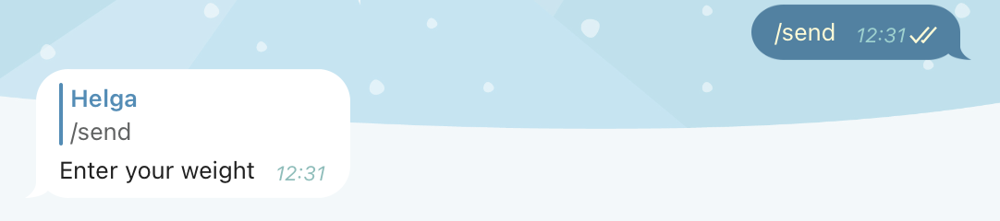
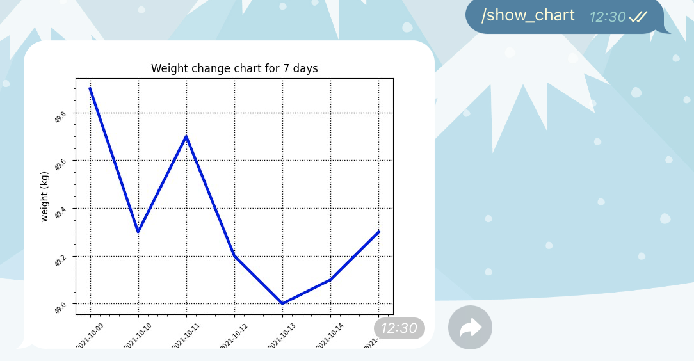

# TelegramBot
This bot helps to track weight changes.

For clarity, you can get a chart of changes over the past 7 days

### Prerequisites

The necessary dependencies are specified in the file requirements.txt

### Installing

To run the project you need to:
1. clone the repository
2. install the necessary libraries
3. run the file bot_w.py
4. Find @track_the_weight_bot
5. launch the bot using the /start command
6. follow the instructions (/help)

## License

This project is licensed under the [CC0 1.0 Universal](LICENSE.md)
Creative Commons License - see the [LICENSE.md](LICENSE.md) file for
details
